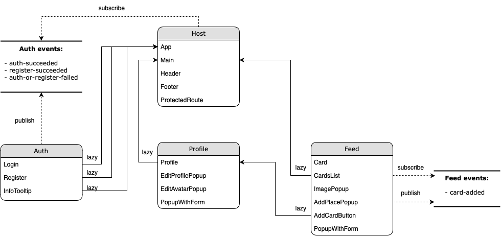

# Задание 1

### Уровень 1. Анализ

Исходное приложение представляет собой монолит с набором бизнес-функций, которые в теории могут разрабатываться независимо разными командами. Переход на микрофронтенды в случае перспектив роста данного проекта позволит избежать в будущем проблем с разработкой и масштабированием. При этом прослеживается слабая связность компонентов, что делает разбиение потенциально более простым и быстрым, минимизируя затраты.

#### Бизнес-домены

Обозначены следующие бизнес-домены:
- Регистрация и авторизация (auth);
- Профиль пользователя (profile);
- Лента (галерея) фотографий (feed).

#### Выбор фреймворка

Для создания микрофронтендов выбран фреймфорк Module Federation, так как написание микрофронтендов планируется на одном и том же фреймворке (React), который можно использовать как shared dependency для всех микрофронтендов, минимизируя количество стороннего кода в браузере.

#### Управление состоянием

Для управления состоянием выбран паттерн Pub/Sub, так как микрофронтенды достаточно независимы и слабо связаны. В перспективе можно реализовать глобальное хранилище для хранения текущего пользователя. В данном случае добавлены события логина, регистрации и добавления карточки.

### Уровень 2. Структура

Схема взаимодействия атомарных компонентов в микрофронтендах (для наглядности распределения фичей):



[Ссылка на draw.io](./sprint_1_1.drawio)

#### Папка blocks

Стили разнесены по микрофронтендам и импортируются в основном локально в файлах React-компонентов, но некоторые стили импортируются глобально, например, для компонента PopupWithForm.

#### Папка utils

Файл api.js в микрофронтендах profile, feed и host содержит только методы, вызываемые в компонентах микрофронтенда. Файл auth.js переехал в микрофронтенд auth.

#### Папка images

Картинки также распределены в соответсвии с их использованием в коде микрофронтендов.

#### Папка vendor

Содержимое vendor перемещено целиком в host, так как оно общее для всего приложения.

### Уровень 3. Запуск

Связку микрофронтендов можно запустить в дев-режиме как локально, так и в Docker.

#### Запуск в Docker

В корневной директории выполнить:
```
docker-compose -f microfrontend.compose.yaml up
```
При первом запуске должны собраться docker-образы каждого микрофронтенда. Приложение будет доступно по адресу http://localhost:8090

#### Запуск локальными командами

В директории каждого микрофронтенда `frontend/microfrontend/{app}` выполнить:
1. Установку зависимостей:
```
npm i
```
2. Запуск:
```
npm start
```
Сервер host желательно запускать последним. Приложение будет доступно по адресу http://localhost:8090

В случае возникновения проблем с запуском просьба обратиться ко мне.
